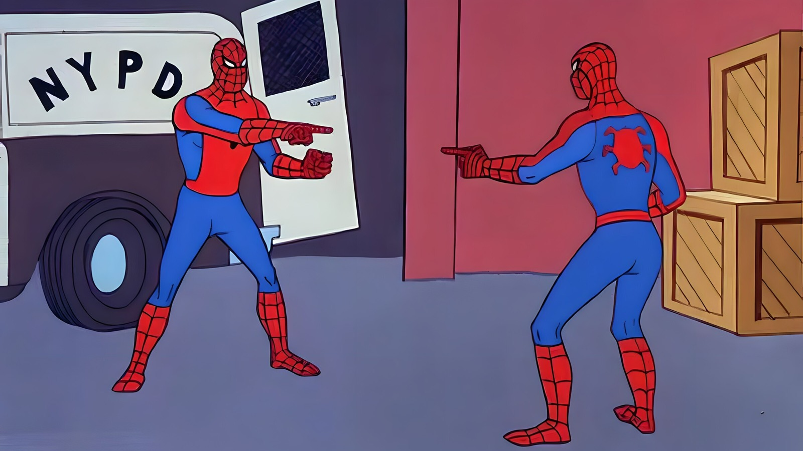

# barcode-denoiser
Statistical denoising of barcode data.

<figure>
    
    <figcaption>
    When there is no way to tell which barcodes are real, we must measure the noise and subtract it from the data.
    </figcaption>
</figure>
