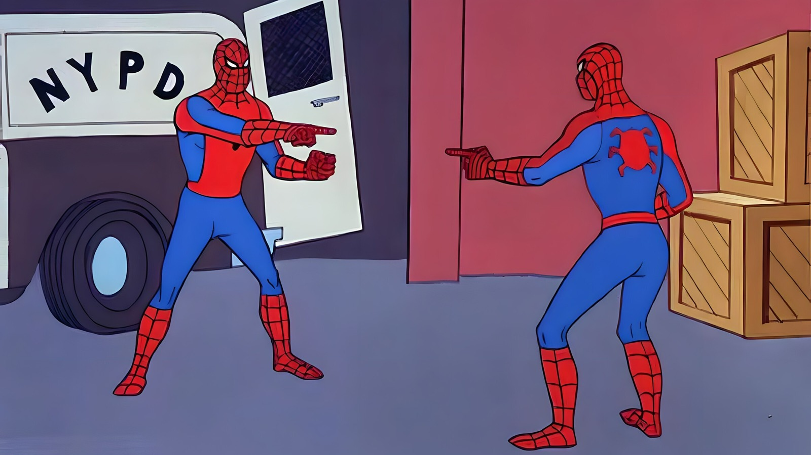

# BarcodeDenoiser
Statistical denoising of DNA barcode data.

<figure>
    
    <figcaption>
    <i>When there is no way to tell which barcodes are real ...</i> 
    <b>Double Identity</b>, Spider-Man 1967.
    </figcaption>
</figure>
  
This package offers a way to statistically measure and remove noise from sequencing data of fixed-length barcodes.

## Contents
1. [Theory](notebooks/theory.ipynb) - A set theoretic perspective on barcode diversity.
2. [Algorithm](notebooks/algorithm.pdf) - Indexing barcode diversity by decomposition.
3. [BarcodeDenoiser.jl](src/BarcodeDenoiser.jl) - Denoising program implemented in Julia.
